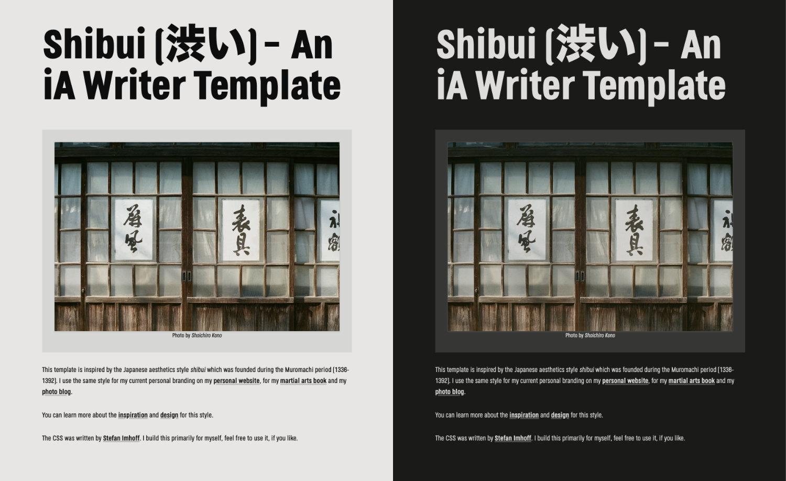

# Shibui (渋い) – An iA Writer Template

This template is inspired by the Japanese aesthetics style _shibui_ which was founded during the Muromachi period (1336-1392). I use the same style for my current personal branding on my [personal website](https://www.stefanimhoff.de/), for my [martial arts book](https://www.kogakure.de/en/) and my [photo blog](https://hamburg.stefanimhoff.de/).

You can learn more about the [inspiration](https://www.stefanimhoff.de/new-website-2020-inspiration/) and [design](https://www.stefanimhoff.de/new-website-2020-design/) for this style.

The CSS was written by [Stefan Imhoff](https://www.stefanimhoff.de/). I build this primarily for myself, feel free to use it, if you like.
